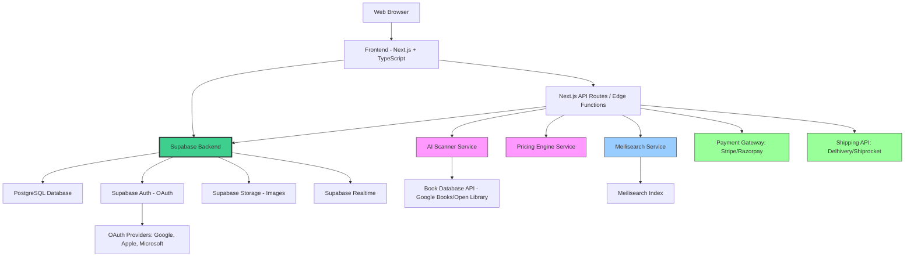
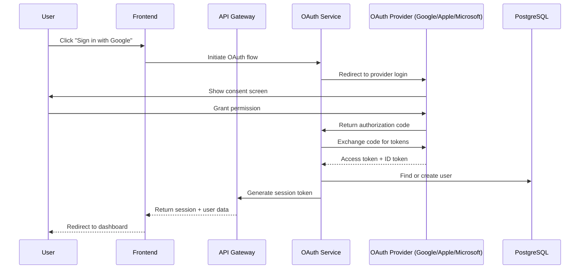
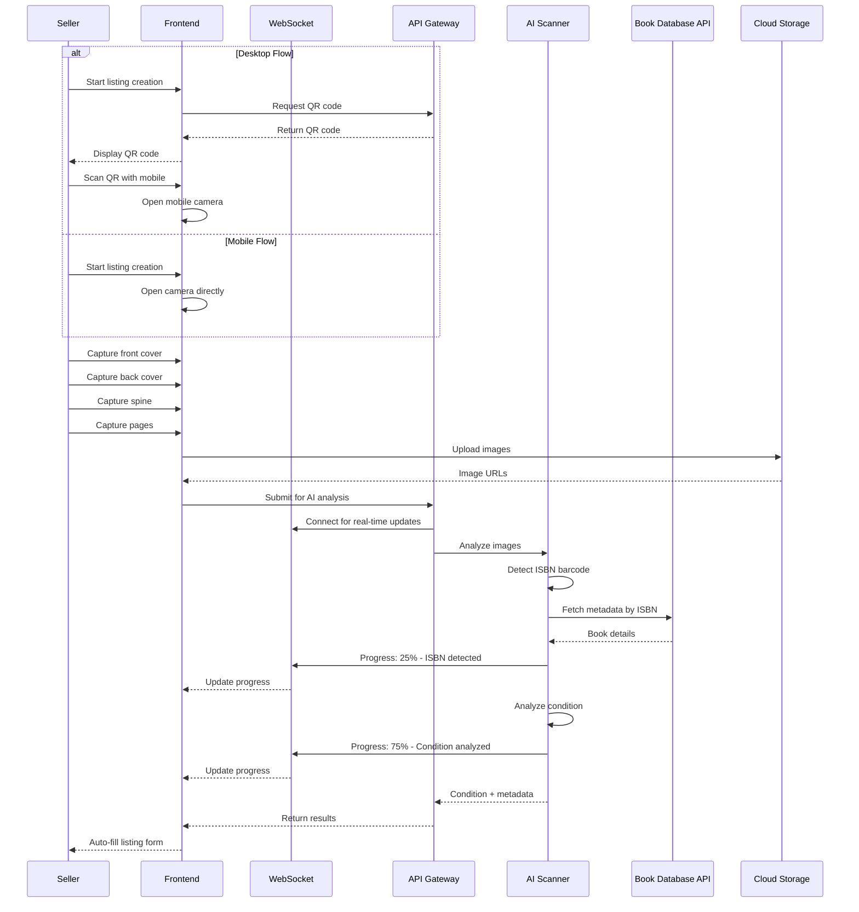
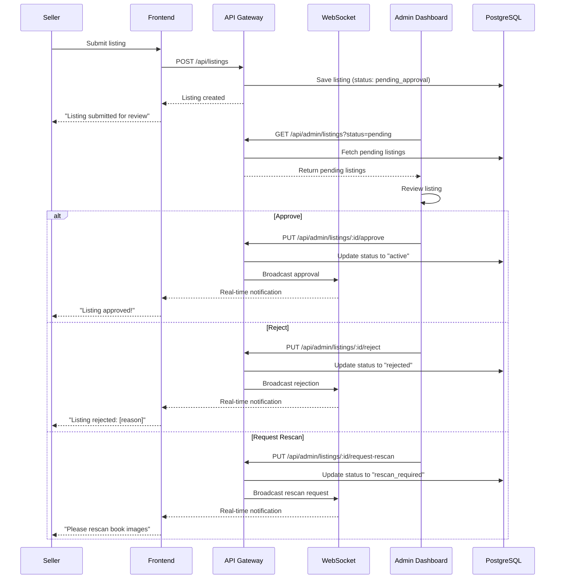
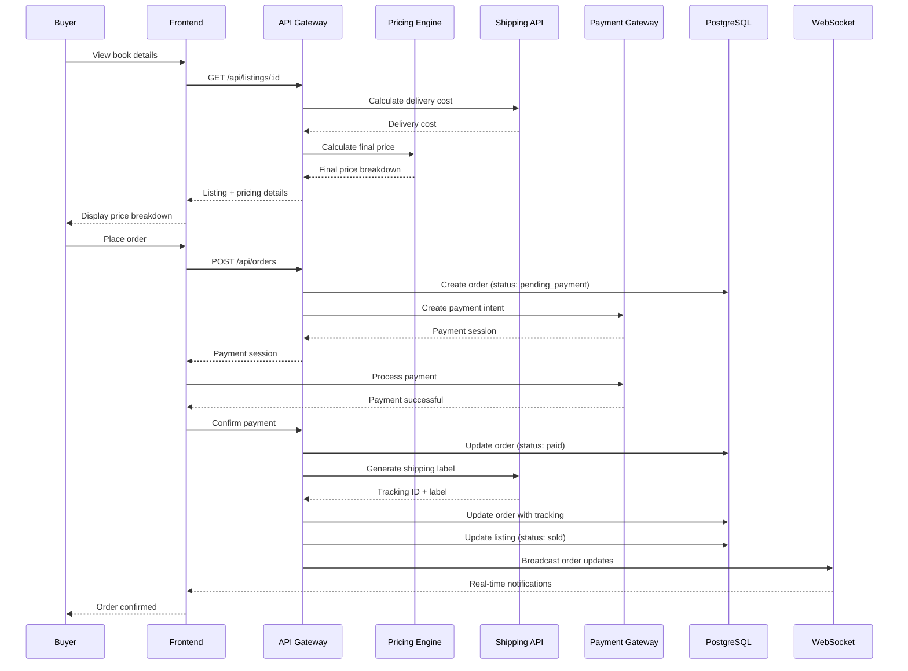

# Design Document: Second-Hand Academic Book Marketplace

## Overview

The Second-Hand Academic Book Marketplace is a production-ready online platform that connects students selling used academic books with buyers seeking affordable educational materials. The platform addresses inefficiencies in India's second-hand book market by providing structured discovery (search and category browsing), AI-powered condition assessment with mobile scanning, automated pricing with real-time cost calculations, admin-moderated listings, secure payment processing, and integrated shipping logistics. The system serves multiple educational segments including school books (K-12), competitive exam materials (JEE, NEET, UPSC), college textbooks, and general reading materials.

The platform operates as a search-first marketplace with a separate seller portal and comprehensive admin dashboard. Sellers list books using an AI scanner that works on both desktop (via QR code for mobile scanning) and mobile (direct camera access), capturing front cover, back cover, spine, and pages with automatic ISBN barcode detection and metadata fetching. All listings require admin approval before becoming visible in the marketplace. Buyers discover books through Meilisearch-powered search or category browsing, with listings prioritized by location proximity. The platform integrates real payment gateways and shipping APIs for end-to-end transaction management.

**Backend Architecture:** The platform uses **Supabase** as the primary backend infrastructure, providing PostgreSQL database, authentication (OAuth with Google, Apple, Microsoft), file storage for images, and real-time subscriptions for live updates. The frontend is built with Next.js and TypeScript, communicating directly with Supabase via the Supabase JavaScript client. Next.js API routes or Supabase Edge Functions handle business logic for AI scanning, pricing calculations, and external API integrations.

The enhanced pricing engine calculates: FinalPrice = OriginalPrice × ConditionMultiplier + DeliveryCost + PlatformCommission + PaymentGatewayFees. The platform tracks environmental impact (trees saved, water saved, CO₂ reduced) and displays metrics on dashboards. This design promotes environmental sustainability by encouraging book reuse and reducing paper waste.

## Architecture



### Architecture Components

**Frontend Layer:**
- Next.js 14+ with TypeScript and Tailwind CSS
- Supabase JavaScript client for database operations
- Direct communication with Supabase services

**Supabase Backend:**
- **PostgreSQL Database**: All relational data (users, books, listings, orders, etc.)
- **Supabase Auth**: OAuth authentication with Google, Apple, Microsoft
- **Supabase Storage**: Image storage with buckets for book covers and scan images
- **Supabase Realtime**: Live subscriptions for listing approvals, order updates, scan progress

**Business Logic Layer:**
- Next.js API routes or Supabase Edge Functions
- AI Scanner integration
- Pricing calculations
- External API integrations (payment, shipping)

**External Services:**
- Meilisearch for fast, typo-tolerant search
- Payment gateways (Stripe/Razorpay)
- Shipping APIs (Delhivery/Shiprocket)
- Book metadata APIs (Google Books, Open Library)


## Sequence Diagrams

### OAuth Authentication Flow



### Enhanced AI Scanner Workflow




### Admin Approval Workflow



### Payment and Shipping Integration Flow




## Components and Interfaces

### Frontend Components

#### HomePage Component

**Purpose**: Landing page with hero section, category cards, search bar, environmental impact metrics, and call-to-action

**Interface**:
```pascal
COMPONENT HomePage
  PROPERTIES
    categories: Array<Category>
    searchQuery: String
    platformStats: PlatformStats
    ecoImpact: EcoImpact
  END PROPERTIES
  
  METHODS
    handleSearch(query: String): Void
    navigateToCategory(categoryId: String): Void
    navigateToSellPortal(): Void
    displayEcoImpact(): Void
  END METHODS
END COMPONENT
```

**Responsibilities**:
- Display hero section with primary call-to-action
- Render category cards for quick navigation
- Handle search input and redirect to search results
- Show environmental impact statistics (trees saved, water saved, CO₂ reduced)
- Display platform metrics (total books listed/sold, active listings)

#### SearchPage Component

**Purpose**: Search interface with Meilisearch-powered search, filters, sorting, and results display

**Interface**:
```pascal
COMPONENT SearchPage
  PROPERTIES
    searchQuery: String
    filters: FilterOptions
    results: Array<BookListing>
    loading: Boolean
    facets: SearchFacets
  END PROPERTIES
  
  METHODS
    executeSearch(query: String, filters: FilterOptions): Void
    applyFilter(filterType: String, value: Any): Void
    sortResults(sortBy: String): Void
    loadMoreResults(): Void
    updateFacets(facets: SearchFacets): Void
  END METHODS
END COMPONENT
```

**Responsibilities**:
- Execute search queries via Meilisearch API
- Manage filter state and apply filters
- Display search results with pagination
- Handle sorting options
- Show faceted search results (category counts, price ranges)


#### BookDetailPage Component

**Purpose**: Display detailed information about a specific book listing with pricing breakdown and purchase options

**Interface**:
```pascal
COMPONENT BookDetailPage
  PROPERTIES
    bookId: String
    bookDetails: BookListing
    pricingBreakdown: PricingBreakdown
    sellerInfo: SellerProfile
    reviews: Array<Review>
    loading: Boolean
  END PROPERTIES
  
  METHODS
    fetchBookDetails(bookId: String): Void
    calculatePricing(): Void
    addToCart(): Void
    addToWishlist(): Void
    placeOrder(): Void
    submitReview(rating: Integer, comment: String): Void
  END METHODS
END COMPONENT
```

**Responsibilities**:
- Fetch and display book details
- Show condition score with visual indicators
- Display pricing breakdown (original price, condition multiplier, delivery cost, platform commission, payment fees, final price)
- Show seller payout calculation
- Handle order placement
- Display and submit reviews
- Manage wishlist and cart actions

#### AdminDashboard Component

**Purpose**: Comprehensive admin interface for platform management, listing moderation, and analytics

**Interface**:
```pascal
COMPONENT AdminDashboard
  PROPERTIES
    platformStats: PlatformStats
    pendingListings: Array<Listing>
    users: Array<User>
    orders: Array<Order>
    moderationLogs: Array<ModerationLog>
    revenueMetrics: RevenueMetrics
    charts: ChartData
  END PROPERTIES
  
  METHODS
    fetchPlatformStats(): Void
    fetchPendingListings(): Void
    approveListing(listingId: String): Void
    rejectListing(listingId: String, reason: String): Void
    requestRescan(listingId: String): Void
    suspendUser(userId: String, reason: String): Void
    warnSeller(userId: String, message: String): Void
    limitListings(userId: String, maxListings: Integer): Void
    resolveDispute(orderId: String, resolution: String): Void
    issueRefund(orderId: String, amount: Decimal): Void
    manageCategories(): Void
    viewModerationLogs(): Void
  END METHODS
END COMPONENT
```

**Responsibilities**:
- Display platform overview with key metrics
- Show pending listings for approval
- Provide listing moderation tools (approve, reject, request rescan)
- Manage users (suspend, warn, limit)
- Track orders and resolve disputes
- Manage categories with hierarchy
- Display revenue and commission metrics
- Show charts (daily sales, listings per day, revenue by category)
- View moderation logs


#### EnhancedAIScannerComponent

**Purpose**: Multi-platform AI scanner with QR code for desktop and direct camera access for mobile

**Interface**:
```pascal
COMPONENT EnhancedAIScannerComponent
  PROPERTIES
    platform: Enum<"desktop", "mobile">
    qrCode: String
    capturedImages: Array<CapturedImage>
    scanProgress: Integer
    detectedISBN: String
    bookMetadata: BookMetadata
    conditionAnalysis: ConditionAnalysis
    wsConnection: WebSocket
  END PROPERTIES
  
  METHODS
    detectPlatform(): String
    generateQRCode(): String
    openCamera(): Void
    captureImage(type: Enum<"front_cover", "back_cover", "spine", "pages">): Void
    uploadImages(): Void
    connectWebSocket(): Void
    receiveProgressUpdate(progress: Integer, message: String): Void
    detectISBN(image: Image): String
    fetchBookMetadata(isbn: String): BookMetadata
    analyzeCondition(images: Array<Image>): ConditionAnalysis
    autoFillForm(metadata: BookMetadata, condition: ConditionAnalysis): Void
  END METHODS
END COMPONENT
```

**Responsibilities**:
- Detect user platform (desktop vs mobile)
- Generate QR code for desktop users
- Open camera interface for mobile users
- Guide user through capturing: front cover, back cover, spine, pages
- Upload images to cloud storage
- Connect to WebSocket for real-time progress updates
- Detect ISBN barcode from images
- Fetch book metadata from external API
- Analyze book condition
- Auto-fill listing form with detected data

#### SellerPortal Component

**Purpose**: Separate interface for sellers to manage listings, orders, and view analytics

**Interface**:
```pascal
COMPONENT SellerPortal
  PROPERTIES
    sellerId: String
    activeListings: Array<BookListing>
    pendingApproval: Array<BookListing>
    orders: Array<Order>
    dashboard: DashboardStats
    ecoImpact: SellerEcoImpact
    earnings: EarningsBreakdown
  END PROPERTIES
  
  METHODS
    createListing(): Void
    viewListings(status: String): Void
    editListing(listingId: String): Void
    deleteListing(listingId: String): Void
    viewOrders(): Void
    trackShipment(orderId: String): Void
    viewEarnings(): Void
    viewEcoImpact(): Void
    downloadInvoice(orderId: String): Void
  END METHODS
END COMPONENT
```

**Responsibilities**:
- Provide seller dashboard with statistics
- Enable listing creation with AI scanner
- Display listings by status (active, pending approval, rejected, sold)
- Show order history and tracking
- Display earnings breakdown (total sales, platform commission, payment fees, net earnings)
- Show seller's environmental impact contribution
- Generate invoices and reports


### Backend Services

#### OAuth Service

**Purpose**: Handle OAuth authentication with Google, Apple, and Microsoft providers

**Interface**:
```pascal
SERVICE OAuthService
  METHODS
    initiateOAuthFlow(provider: Enum<"google", "apple", "microsoft">): Result<AuthURL>
    handleCallback(provider: String, code: String): Result<AuthTokens>
    exchangeCodeForTokens(provider: String, code: String): Result<OAuthTokens>
    verifyIDToken(provider: String, idToken: String): Result<UserProfile>
    findOrCreateUser(profile: UserProfile): Result<User>
    generateSessionToken(user: User): Result<SessionToken>
    revokeSession(sessionToken: String): Result<Boolean>
    refreshSession(refreshToken: String): Result<SessionToken>
  END METHODS
END SERVICE
```

**Responsibilities**:
- Initiate OAuth flow with provider-specific URLs
- Handle OAuth callbacks and exchange authorization codes
- Verify ID tokens from providers
- Find existing user or create new user from OAuth profile
- Generate secure session tokens
- Manage session lifecycle (refresh, revoke)
- Store OAuth provider IDs for account linking

#### Admin Service

**Purpose**: Manage listing moderation, user management, and platform administration

**Interface**:
```pascal
SERVICE AdminService
  METHODS
    getPendingListings(page: Integer, pageSize: Integer): Result<Array<Listing>>
    approveListing(listingId: String, adminId: String): Result<Listing>
    rejectListing(listingId: String, adminId: String, reason: String): Result<Listing>
    requestRescan(listingId: String, adminId: String, notes: String): Result<Listing>
    getPlatformStats(): Result<PlatformStats>
    getUserList(filters: UserFilters): Result<Array<User>>
    suspendUser(userId: String, adminId: String, reason: String, duration: Integer): Result<User>
    warnSeller(userId: String, adminId: String, message: String): Result<Notification>
    limitListings(userId: String, maxListings: Integer): Result<User>
    getOrderList(filters: OrderFilters): Result<Array<Order>>
    resolveDispute(orderId: String, resolution: String): Result<Order>
    issueRefund(orderId: String, amount: Decimal, reason: String): Result<Refund>
    manageCategories(action: String, categoryData: Category): Result<Category>
    getModerationLogs(filters: LogFilters): Result<Array<ModerationLog>>
    getRevenueMetrics(startDate: Date, endDate: Date): Result<RevenueMetrics>
  END METHODS
END SERVICE
```

**Responsibilities**:
- Fetch and manage pending listings
- Approve, reject, or request rescan for listings
- Track moderation actions in logs
- Manage users (suspend, warn, limit)
- Resolve order disputes
- Process refunds
- Manage category hierarchy
- Generate platform statistics and metrics
- Calculate revenue and commission data


#### Enhanced AI Scanner Service

**Purpose**: Analyze book images with ISBN detection and metadata fetching

**Interface**:
```pascal
SERVICE EnhancedAIScannerService
  METHODS
    analyzeImages(imageUrls: Array<String>): Result<ScanResult>
    detectISBN(imageUrl: String): Result<String>
    fetchBookMetadata(isbn: String): Result<BookMetadata>
    analyzeCondition(imageUrls: Array<String>): Result<ConditionAnalysis>
    validateImages(imageUrls: Array<String>): Result<ValidationResult>
    getConditionScore(analysis: ConditionAnalysis): Integer
    getConditionDetails(analysis: ConditionAnalysis): ConditionDetails
    publishProgress(scanId: String, progress: Integer, message: String): Void
  END METHODS
END SERVICE
```

**Responsibilities**:
- Analyze uploaded book images
- Detect ISBN barcode from cover images
- Fetch book metadata from external book database API
- Evaluate condition factors (cover damage, page quality, binding, markings)
- Assign condition score (1-5) with detailed breakdown
- Publish real-time progress updates via WebSocket
- Validate image quality and content

#### Enhanced Pricing Engine Service

**Purpose**: Calculate final prices with delivery costs, platform commission, and payment fees

**Interface**:
```pascal
SERVICE EnhancedPricingEngineService
  METHODS
    calculateFinalPrice(params: PricingParams): Result<PricingBreakdown>
    getConditionMultiplier(conditionScore: Integer): Decimal
    fetchDeliveryCost(origin: Location, destination: Location): Result<Decimal>
    calculatePlatformCommission(basePrice: Decimal): Decimal
    calculatePaymentFees(amount: Decimal): Decimal
    calculateSellerPayout(finalPrice: Decimal, deliveryCost: Decimal): Decimal
    getPriceRange(finalPrice: Decimal): Result<PriceRange>
    validatePricing(pricing: PricingBreakdown): Result<Boolean>
  END METHODS
END SERVICE
```

**Responsibilities**:
- Calculate final price using formula: FinalPrice = OriginalPrice × ConditionMultiplier - DeliveryCost - PlatformCommission - PaymentGatewayFees
- Apply condition-based multipliers: Like New=80%, Very Good=70%, Good=60%, Acceptable=40%, Poor=25%
- Fetch real-time delivery costs from shipping API
- Calculate platform commission (e.g., 10% of base price)
- Calculate payment gateway fees (e.g., 2.5% + ₹3)
- Calculate seller payout after deductions
- Provide price range recommendations
- Validate pricing calculations


#### Payment Gateway Service

**Purpose**: Handle secure payment processing, transaction tracking, and refunds

**Interface**:
```pascal
SERVICE PaymentGatewayService
  METHODS
    createPaymentIntent(orderId: String, amount: Decimal): Result<PaymentSession>
    confirmPayment(paymentIntentId: String): Result<PaymentConfirmation>
    capturePayment(paymentIntentId: String): Result<Payment>
    processRefund(paymentId: String, amount: Decimal, reason: String): Result<Refund>
    getPaymentStatus(paymentId: String): Result<PaymentStatus>
    calculateFees(amount: Decimal): Decimal
    validatePaymentMethod(paymentMethodId: String): Result<Boolean>
    getTransactionHistory(userId: String): Result<Array<Transaction>>
    initiateSellerPayout(sellerId: String, amount: Decimal): Result<Payout>
    getPayoutStatus(payoutId: String): Result<PayoutStatus>
  END METHODS
END SERVICE
```

**Responsibilities**:
- Create payment intents for orders
- Process secure payments via Stripe/Razorpay
- Confirm and capture payments
- Handle refunds with reason tracking
- Calculate payment gateway fees
- Track transaction history
- Initiate seller payouts
- Validate payment methods
- Handle payment webhooks

#### Shipping API Service

**Purpose**: Integrate with courier APIs for delivery cost calculation, label generation, and tracking

**Interface**:
```pascal
SERVICE ShippingAPIService
  METHODS
    calculateDeliveryCost(origin: Location, destination: Location, weight: Decimal): Result<DeliveryCost>
    generateShippingLabel(orderId: String, shipmentDetails: ShipmentDetails): Result<ShippingLabel>
    schedulePickup(orderId: String, pickupAddress: Address, pickupDate: Date): Result<PickupConfirmation>
    trackShipment(trackingId: String): Result<ShipmentStatus>
    updateShipmentStatus(trackingId: String, status: String): Result<Shipment>
    cancelShipment(trackingId: String, reason: String): Result<Boolean>
    getAvailableCouriers(origin: Location, destination: Location): Result<Array<Courier>>
    estimateDeliveryDate(origin: Location, destination: Location): Result<Date>
    storeShippingInfo(orderId: String, shippingData: ShippingData): Result<Boolean>
  END METHODS
END SERVICE
```

**Responsibilities**:
- Calculate real-time delivery costs from courier API
- Generate shipping labels with tracking IDs
- Schedule pickups from seller locations
- Track shipment status in real-time
- Update order status based on shipment events
- Store shipping information in database
- Handle shipment cancellations
- Estimate delivery dates
- Support multiple courier providers


#### Environmental Impact Service

**Purpose**: Track and calculate environmental impact metrics

**Interface**:
```pascal
SERVICE EnvironmentalImpactService
  METHODS
    calculateTreesSaved(booksReused: Integer): Decimal
    calculateWaterSaved(booksReused: Integer): Decimal
    calculateCO2Reduced(booksReused: Integer): Decimal
    updateUserImpact(userId: String, booksSold: Integer, booksBought: Integer): Result<EcoImpact>
    getPlatformImpact(): Result<PlatformEcoImpact>
    getUserImpact(userId: String): Result<UserEcoImpact>
    trackBookReuse(bookId: String): Result<Boolean>
    generateImpactReport(startDate: Date, endDate: Date): Result<ImpactReport>
  END METHODS
END SERVICE
```

**Responsibilities**:
- Calculate trees saved using formula: TreesSaved = BooksReused / 30
- Calculate water saved (liters per book)
- Calculate CO₂ reduced (kg per book)
- Track individual user contributions
- Aggregate platform-wide impact
- Generate impact reports
- Display metrics on dashboards and homepage

#### Search Service (Meilisearch)

**Purpose**: Provide fast, typo-tolerant search with faceted filtering

**Interface**:
```pascal
SERVICE MeilisearchService
  METHODS
    search(query: String, filters: FilterOptions, location: Location): Result<SearchResults>
    indexListing(listing: Listing): Result<Boolean>
    updateIndex(listingId: String, updates: Listing): Result<Boolean>
    removeFromIndex(listingId: String): Result<Boolean>
    getFacets(query: String): Result<Facets>
    autocomplete(partialQuery: String): Result<Array<String>>
    configureIndex(settings: IndexSettings): Result<Boolean>
    getSearchStats(): Result<SearchStats>
  END METHODS
END SERVICE
```

**Responsibilities**:
- Perform typo-tolerant full-text search
- Support faceted search (category, condition, price range)
- Provide autocomplete suggestions
- Index listings for fast retrieval
- Update index on listing changes
- Remove listings from index
- Configure search relevance and ranking
- Track search analytics


#### WebSocket Service

**Purpose**: Enable real-time updates for listing approvals, order status, and AI scan progress

**Interface**:
```pascal
SERVICE WebSocketService
  METHODS
    connect(userId: String, sessionToken: String): Result<WebSocketConnection>
    disconnect(connectionId: String): Result<Boolean>
    subscribe(connectionId: String, channel: String): Result<Boolean>
    unsubscribe(connectionId: String, channel: String): Result<Boolean>
    broadcast(channel: String, message: Message): Result<Boolean>
    sendToUser(userId: String, message: Message): Result<Boolean>
    publishListingApproval(listingId: String, status: String): Void
    publishOrderUpdate(orderId: String, status: String): Void
    publishScanProgress(scanId: String, progress: Integer, message: String): Void
  END METHODS
END SERVICE
```

**Responsibilities**:
- Manage WebSocket connections
- Handle user authentication for connections
- Support channel-based subscriptions
- Broadcast messages to channels
- Send targeted messages to specific users
- Publish real-time updates for:
  - Listing approval/rejection
  - Order status changes
  - AI scan progress
  - Payment confirmations
  - Shipment tracking updates

## Data Models

### User Model (PostgreSQL)

```pascal
STRUCTURE User
  id: UUID (PRIMARY KEY)
  oauth_provider: Enum<"google", "apple", "microsoft">
  oauth_provider_id: String (UNIQUE)
  email: String (UNIQUE)
  name: String
  profile_picture: String
  role: Enum<"buyer", "seller", "admin">
  location: Location
  created_at: Timestamp
  updated_at: Timestamp
  is_active: Boolean
  rating: Decimal
  total_transactions: Integer
  suspended_until: Timestamp
  listing_limit: Integer
  eco_impact: UserEcoImpact
END STRUCTURE

STRUCTURE Location
  city: String
  state: String
  pincode: String
  latitude: Decimal
  longitude: Decimal
END STRUCTURE

STRUCTURE UserEcoImpact
  books_sold: Integer
  books_bought: Integer
  trees_saved: Decimal
  water_saved_liters: Decimal
  co2_reduced_kg: Decimal
END STRUCTURE
```

**Validation Rules**:
- email must be valid email format and unique
- oauth_provider_id must be unique per provider
- name must be non-empty string
- role must be one of: "buyer", "seller", "admin"
- rating must be between 0.0 and 5.0
- total_transactions must be non-negative integer
- listing_limit defaults to unlimited (-1) or specific number


### Book Model (PostgreSQL)

```pascal
STRUCTURE Book
  id: UUID (PRIMARY KEY)
  isbn: String (UNIQUE)
  title: String
  author: String
  publisher: String
  edition: String
  publication_year: Integer
  category_id: UUID (FOREIGN KEY -> Categories)
  subject: String
  description: String
  cover_image: String
  created_at: Timestamp
  updated_at: Timestamp
END STRUCTURE
```

**Validation Rules**:
- title must be non-empty string
- author must be non-empty string
- isbn must be valid ISBN-10 or ISBN-13 format (optional but unique if provided)
- category_id must reference valid Category

### Category Model (PostgreSQL)

```pascal
STRUCTURE Category
  id: UUID (PRIMARY KEY)
  name: String
  type: Enum<"school", "competitive_exam", "college", "general">
  parent_id: UUID (FOREIGN KEY -> Categories, nullable)
  metadata: CategoryMetadata
  created_at: Timestamp
  updated_at: Timestamp
END STRUCTURE

STRUCTURE CategoryMetadata
  board: String (for school)
  class_level: Integer (for school)
  exam_type: String (for competitive_exam)
  stream: String (for college)
  year_semester: String (for college)
  genre: String (for general)
END STRUCTURE
```

**Validation Rules**:
- name must be non-empty string
- type must be one of: "school", "competitive_exam", "college", "general"
- parent_id enables hierarchical categories
- metadata fields are type-specific

### Listing Model (PostgreSQL)

```pascal
STRUCTURE Listing
  id: UUID (PRIMARY KEY)
  book_id: UUID (FOREIGN KEY -> Books)
  seller_id: UUID (FOREIGN KEY -> Users)
  original_price: Decimal
  condition_score: Integer
  condition_details: ConditionDetails
  suggested_price: Decimal
  final_price: Decimal
  delivery_cost: Decimal
  platform_commission: Decimal
  payment_fees: Decimal
  seller_payout: Decimal
  status: Enum<"pending_approval", "active", "sold", "rejected", "rescan_required", "inactive">
  rejection_reason: String
  images: Array<String>
  location: Location
  created_at: Timestamp
  updated_at: Timestamp
  approved_at: Timestamp
  approved_by: UUID (FOREIGN KEY -> Users)
  views: Integer
  is_featured: Boolean
END STRUCTURE

STRUCTURE ConditionDetails
  cover_damage: Integer (1-5)
  page_quality: Integer (1-5)
  binding_quality: Integer (1-5)
  markings: Integer (1-5)
  discoloration: Integer (1-5)
  overall_notes: String
END STRUCTURE
```

**Validation Rules**:
- book_id must reference valid Book
- seller_id must reference valid User with seller role
- original_price must be positive decimal
- condition_score must be integer between 1 and 5
- final_price must be positive decimal
- status must be one of: "pending_approval", "active", "sold", "rejected", "rescan_required", "inactive"
- images array must contain at least 1 and at most 10 image URLs
- All condition_details fields must be integers between 1 and 5
- approved_by must reference admin user when status is "active"


### Order Model (PostgreSQL)

```pascal
STRUCTURE Order
  id: UUID (PRIMARY KEY)
  listing_id: UUID (FOREIGN KEY -> Listings, UNIQUE)
  buyer_id: UUID (FOREIGN KEY -> Users)
  seller_id: UUID (FOREIGN KEY -> Users)
  book_id: UUID (FOREIGN KEY -> Books)
  price: Decimal
  delivery_cost: Decimal
  platform_commission: Decimal
  payment_fees: Decimal
  seller_payout: Decimal
  status: Enum<"pending_payment", "paid", "shipped", "delivered", "cancelled">
  delivery_address: Address
  pickup_address: Address
  tracking_id: String (UNIQUE)
  payment_id: String
  payment_status: Enum<"pending", "completed", "failed", "refunded">
  created_at: Timestamp
  updated_at: Timestamp
  paid_at: Timestamp
  shipped_at: Timestamp
  delivered_at: Timestamp
  cancelled_at: Timestamp
END STRUCTURE

STRUCTURE Address
  name: String
  phone: String
  address_line1: String
  address_line2: String
  city: String
  state: String
  pincode: String
  landmark: String
END STRUCTURE
```

**Validation Rules**:
- listing_id must reference valid Listing with status "active"
- buyer_id and seller_id must reference valid Users
- price must be positive decimal
- status must be one of: "pending_payment", "paid", "shipped", "delivered", "cancelled"
- payment_status must be one of: "pending", "completed", "failed", "refunded"
- tracking_id must be unique string
- All address fields except address_line2 and landmark are required
- pincode must be valid 6-digit Indian pincode

### Payment Model (PostgreSQL)

```pascal
STRUCTURE Payment
  id: UUID (PRIMARY KEY)
  order_id: UUID (FOREIGN KEY -> Orders)
  payment_intent_id: String (UNIQUE)
  amount: Decimal
  currency: String
  payment_method: String
  payment_gateway: Enum<"stripe", "razorpay">
  status: Enum<"pending", "processing", "completed", "failed", "refunded">
  gateway_fees: Decimal
  created_at: Timestamp
  updated_at: Timestamp
  completed_at: Timestamp
  refunded_at: Timestamp
  refund_amount: Decimal
  refund_reason: String
END STRUCTURE
```

**Validation Rules**:
- order_id must reference valid Order
- amount must be positive decimal
- currency defaults to "INR"
- payment_gateway must be one of: "stripe", "razorpay"
- status must be one of: "pending", "processing", "completed", "failed", "refunded"


### Shipping Model (PostgreSQL)

```pascal
STRUCTURE Shipping
  id: UUID (PRIMARY KEY)
  order_id: UUID (FOREIGN KEY -> Orders, UNIQUE)
  tracking_id: String (UNIQUE)
  courier_name: String
  courier_service: String
  shipping_label_url: String
  weight_kg: Decimal
  dimensions: ShipmentDimensions
  pickup_scheduled_at: Timestamp
  picked_up_at: Timestamp
  in_transit_at: Timestamp
  out_for_delivery_at: Timestamp
  delivered_at: Timestamp
  delivery_attempts: Integer
  current_location: String
  estimated_delivery: Timestamp
  actual_delivery: Timestamp
  created_at: Timestamp
  updated_at: Timestamp
END STRUCTURE

STRUCTURE ShipmentDimensions
  length_cm: Decimal
  width_cm: Decimal
  height_cm: Decimal
END STRUCTURE
```

**Validation Rules**:
- order_id must reference valid Order
- tracking_id must be unique
- weight_kg must be positive decimal
- delivery_attempts must be non-negative integer

### Review Model (PostgreSQL)

```pascal
STRUCTURE Review
  id: UUID (PRIMARY KEY)
  order_id: UUID (FOREIGN KEY -> Orders, UNIQUE)
  reviewer_id: UUID (FOREIGN KEY -> Users)
  reviewee_id: UUID (FOREIGN KEY -> Users)
  rating: Integer
  comment: String
  created_at: Timestamp
  updated_at: Timestamp
END STRUCTURE
```

**Validation Rules**:
- order_id must reference completed Order
- rating must be integer between 1 and 5
- comment must be non-empty string (max 500 characters)

### Wishlist Model (PostgreSQL)

```pascal
STRUCTURE Wishlist
  id: UUID (PRIMARY KEY)
  user_id: UUID (FOREIGN KEY -> Users)
  book_id: UUID (FOREIGN KEY -> Books)
  created_at: Timestamp
END STRUCTURE
```

**Validation Rules**:
- Composite unique constraint on (user_id, book_id)

### ModerationLog Model (PostgreSQL)

```pascal
STRUCTURE ModerationLog
  id: UUID (PRIMARY KEY)
  admin_id: UUID (FOREIGN KEY -> Users)
  action: Enum<"approve", "reject", "request_rescan", "suspend_user", "warn_seller", "limit_listings">
  target_type: Enum<"listing", "user", "order">
  target_id: UUID
  reason: String
  notes: String
  created_at: Timestamp
END STRUCTURE
```

**Validation Rules**:
- admin_id must reference User with admin role
- action must be valid moderation action
- target_type and target_id must reference valid entity


### PlatformStats Model (PostgreSQL)

```pascal
STRUCTURE PlatformStats
  id: UUID (PRIMARY KEY)
  date: Date (UNIQUE)
  total_books_listed: Integer
  total_books_sold: Integer
  active_listings: Integer
  total_users: Integer
  total_buyers: Integer
  total_sellers: Integer
  revenue_generated: Decimal
  platform_commission_earned: Decimal
  trees_saved: Decimal
  water_saved_liters: Decimal
  co2_reduced_kg: Decimal
  created_at: Timestamp
  updated_at: Timestamp
END STRUCTURE
```

**Validation Rules**:
- date must be unique (one record per day)
- All numeric fields must be non-negative

### AI_Scan Model (PostgreSQL)

```pascal
STRUCTURE AI_Scan
  id: UUID (PRIMARY KEY)
  listing_id: UUID (FOREIGN KEY -> Listings)
  images: Array<String>
  detected_isbn: String
  fetched_metadata: BookMetadata
  condition_analysis: ConditionAnalysis
  scan_status: Enum<"in_progress", "completed", "failed">
  progress_percentage: Integer
  error_message: String
  created_at: Timestamp
  completed_at: Timestamp
END STRUCTURE

STRUCTURE BookMetadata
  title: String
  author: String
  publisher: String
  edition: String
  publication_year: Integer
  isbn: String
  cover_image: String
END STRUCTURE

STRUCTURE ConditionAnalysis
  cover_damage: Integer
  page_quality: Integer
  binding_quality: Integer
  markings: Integer
  discoloration: Integer
  overall_score: Integer
  confidence: Decimal
  notes: String
END STRUCTURE
```

**Validation Rules**:
- listing_id must reference valid Listing
- scan_status must be one of: "in_progress", "completed", "failed"
- progress_percentage must be between 0 and 100
- All condition scores must be between 1 and 5


## Algorithmic Pseudocode

### Enhanced AI Scanning with ISBN Detection

```pascal
ALGORITHM enhancedAIScanning(images, scanId)
INPUT: images - Array of image URLs (front_cover, back_cover, spine, pages)
       scanId - UUID for tracking progress
OUTPUT: scanResult - ScanResult object

BEGIN
  ASSERT images IS NOT NULL AND LENGTH(images) >= 4
  ASSERT scanId IS NOT NULL
  
  // Initialize scan result
  scanResult ← CREATE ScanResult
  scanResult.scan_id ← scanId
  scanResult.status ← "in_progress"
  
  // Publish initial progress
  publishProgress(scanId, 0, "Starting scan...")
  
  // Step 1: Detect ISBN from cover images
  isbn ← NULL
  FOR each image IN [images.front_cover, images.back_cover] DO
    publishProgress(scanId, 10, "Detecting ISBN...")
    detectedISBN ← detectISBNBarcode(image)
    IF detectedISBN IS NOT NULL THEN
      isbn ← detectedISBN
      BREAK
    END IF
  END FOR
  
  scanResult.detected_isbn ← isbn
  publishProgress(scanId, 25, "ISBN detected: " + isbn)
  
  // Step 2: Fetch book metadata from external API
  IF isbn IS NOT NULL THEN
    publishProgress(scanId, 30, "Fetching book metadata...")
    metadata ← fetchBookMetadataFromAPI(isbn)
    scanResult.book_metadata ← metadata
    publishProgress(scanId, 50, "Metadata fetched")
  ELSE
    publishProgress(scanId, 50, "ISBN not detected, manual entry required")
  END IF
  
  // Step 3: Analyze book condition
  publishProgress(scanId, 55, "Analyzing book condition...")
  conditionAnalysis ← analyzeBookCondition(images)
  scanResult.condition_analysis ← conditionAnalysis
  publishProgress(scanId, 90, "Condition analysis complete")
  
  // Step 4: Finalize scan
  scanResult.status ← "completed"
  scanResult.overall_score ← conditionAnalysis.overall_score
  publishProgress(scanId, 100, "Scan complete!")
  
  ASSERT scanResult.status = "completed"
  ASSERT scanResult.overall_score >= 1 AND scanResult.overall_score <= 5
  
  RETURN scanResult
END
```

**Preconditions**:
- images array contains at least 4 images (front_cover, back_cover, spine, pages)
- All image URLs are valid and accessible
- scanId is unique identifier for tracking
- WebSocket connection is established for progress updates

**Postconditions**:
- Returns ScanResult with detected ISBN (if found)
- Returns book metadata (if ISBN detected)
- Returns condition analysis with score 1-5
- Progress updates published at each step
- scan_status is "completed" or "failed"

**Loop Invariants**:
- Progress percentage increases monotonically
- Scan status remains valid throughout
- All published progress messages are non-empty


### Enhanced Pricing Calculation with Real Costs

```pascal
ALGORITHM calculateEnhancedPricing(originalPrice, conditionScore, sellerLocation, buyerLocation)
INPUT: originalPrice - Decimal (original book price)
       conditionScore - Integer (1-5 condition rating)
       sellerLocation - Location object
       buyerLocation - Location object
OUTPUT: pricingBreakdown - PricingBreakdown object

BEGIN
  ASSERT originalPrice > 0
  ASSERT conditionScore >= 1 AND conditionScore <= 5
  ASSERT sellerLocation IS NOT NULL
  ASSERT buyerLocation IS NOT NULL
  
  // Define condition multipliers (updated percentages)
  multipliers ← MAP {
    5: 0.80,  // Like New - 80% of original
    4: 0.70,  // Very Good - 70% of original
    3: 0.60,  // Good - 60% of original
    2: 0.40,  // Acceptable - 40% of original
    1: 0.25   // Poor - 25% of original
  }
  
  // Step 1: Calculate base price from condition
  multiplier ← multipliers[conditionScore]
  basePrice ← originalPrice * multiplier
  
  // Step 2: Fetch real delivery cost from shipping API
  deliveryCost ← fetchDeliveryCostFromAPI(sellerLocation, buyerLocation, estimatedWeight=0.5)
  
  // Step 3: Calculate platform commission (10% of base price)
  platformCommission ← basePrice * 0.10
  
  // Step 4: Calculate payment gateway fees (2.5% + ₹3)
  paymentFees ← (basePrice * 0.025) + 3.00
  
  // Step 5: Calculate final price
  finalPrice ← basePrice + deliveryCost + platformCommission + paymentFees
  
  // Round to nearest rupee
  finalPrice ← ROUND(finalPrice)
  
  // Step 6: Calculate seller payout
  sellerPayout ← basePrice - platformCommission
  
  // Step 7: Create pricing breakdown
  breakdown ← CREATE PricingBreakdown
  breakdown.original_price ← originalPrice
  breakdown.condition_score ← conditionScore
  breakdown.condition_multiplier ← multiplier
  breakdown.base_price ← basePrice
  breakdown.delivery_cost ← deliveryCost
  breakdown.platform_commission ← platformCommission
  breakdown.payment_fees ← paymentFees
  breakdown.final_price ← finalPrice
  breakdown.seller_payout ← sellerPayout
  breakdown.discount_percentage ← ((originalPrice - finalPrice) / originalPrice) * 100
  
  ASSERT breakdown.final_price > 0
  ASSERT breakdown.seller_payout > 0
  ASSERT breakdown.seller_payout < breakdown.final_price
  
  RETURN breakdown
END
```

**Preconditions**:
- originalPrice is positive decimal value
- conditionScore is integer between 1 and 5 (inclusive)
- sellerLocation and buyerLocation have valid coordinates
- Shipping API is accessible

**Postconditions**:
- Returns PricingBreakdown with all fields populated
- final_price includes all costs (base + delivery + commission + fees)
- seller_payout is base_price minus platform_commission
- All prices are positive decimals
- discount_percentage accurately reflects total savings

**Loop Invariants**: N/A (no loops in this algorithm)


### Admin Approval Processing

```pascal
ALGORITHM processAdminApproval(listingId, adminId, action, reason)
INPUT: listingId - UUID
       adminId - UUID
       action - Enum<"approve", "reject", "request_rescan">
       reason - String (optional for approve, required for reject/rescan)
OUTPUT: result - ApprovalResult object

BEGIN
  ASSERT listingId IS NOT NULL
  ASSERT adminId IS NOT NULL
  ASSERT action IN ["approve", "reject", "request_rescan"]
  
  // Step 1: Fetch listing
  listing ← fetchListing(listingId)
  
  IF listing IS NULL THEN
    RETURN Error("Listing not found")
  END IF
  
  IF listing.status ≠ "pending_approval" THEN
    RETURN Error("Listing is not pending approval")
  END IF
  
  // Step 2: Verify admin permissions
  admin ← fetchUser(adminId)
  
  IF admin IS NULL OR admin.role ≠ "admin" THEN
    RETURN Error("Unauthorized: Admin access required")
  END IF
  
  // Step 3: Process action
  IF action = "approve" THEN
    listing.status ← "active"
    listing.approved_at ← getCurrentTimestamp()
    listing.approved_by ← adminId
    
    // Add to search index
    addToMeilisearchIndex(listing)
    
    // Publish real-time notification
    publishWebSocketMessage(listing.seller_id, {
      type: "listing_approved",
      listing_id: listingId,
      message: "Your listing has been approved!"
    })
    
  ELSE IF action = "reject" THEN
    ASSERT reason IS NOT NULL AND reason ≠ ""
    
    listing.status ← "rejected"
    listing.rejection_reason ← reason
    
    // Publish real-time notification
    publishWebSocketMessage(listing.seller_id, {
      type: "listing_rejected",
      listing_id: listingId,
      reason: reason
    })
    
  ELSE IF action = "request_rescan" THEN
    listing.status ← "rescan_required"
    listing.rejection_reason ← reason
    
    // Publish real-time notification
    publishWebSocketMessage(listing.seller_id, {
      type: "rescan_requested",
      listing_id: listingId,
      notes: reason
    })
  END IF
  
  // Step 4: Update listing in database
  updateListing(listing)
  
  // Step 5: Log moderation action
  logModerationAction({
    admin_id: adminId,
    action: action,
    target_type: "listing",
    target_id: listingId,
    reason: reason,
    created_at: getCurrentTimestamp()
  })
  
  // Step 6: Create result
  result ← CREATE ApprovalResult
  result.success ← TRUE
  result.listing ← listing
  result.action ← action
  
  ASSERT result.success = TRUE
  ASSERT listing.status IN ["active", "rejected", "rescan_required"]
  
  RETURN result
END
```

**Preconditions**:
- listingId references valid Listing with status "pending_approval"
- adminId references valid User with role "admin"
- action is valid approval action
- reason is provided for reject and request_rescan actions
- WebSocket service is available

**Postconditions**:
- Listing status is updated to "active", "rejected", or "rescan_required"
- Moderation action is logged
- Real-time notification sent to seller
- If approved, listing is added to search index
- approved_at and approved_by are set for approved listings

**Loop Invariants**: N/A (no loops in this algorithm)


### Order Processing with Payment and Shipping

```pascal
ALGORITHM processOrderWithPaymentAndShipping(buyerId, listingId, deliveryAddress)
INPUT: buyerId - UUID
       listingId - UUID
       deliveryAddress - Address object
OUTPUT: order - Order object

BEGIN
  ASSERT buyerId IS NOT NULL
  ASSERT listingId IS NOT NULL
  ASSERT deliveryAddress IS VALID
  
  // Step 1: Validate listing availability
  listing ← fetchListing(listingId)
  
  IF listing IS NULL THEN
    RETURN Error("Listing not found")
  END IF
  
  IF listing.status ≠ "active" THEN
    RETURN Error("Listing is not available")
  END IF
  
  // Step 2: Validate buyer
  buyer ← fetchUser(buyerId)
  
  IF buyer IS NULL THEN
    RETURN Error("Buyer not found")
  END IF
  
  // Step 3: Calculate pricing with delivery cost
  pricingBreakdown ← calculateEnhancedPricing(
    listing.original_price,
    listing.condition_score,
    listing.location,
    deliveryAddress
  )
  
  // Step 4: Create order
  order ← CREATE Order
  order.id ← generateUUID()
  order.listing_id ← listingId
  order.buyer_id ← buyerId
  order.seller_id ← listing.seller_id
  order.book_id ← listing.book_id
  order.price ← pricingBreakdown.final_price
  order.delivery_cost ← pricingBreakdown.delivery_cost
  order.platform_commission ← pricingBreakdown.platform_commission
  order.payment_fees ← pricingBreakdown.payment_fees
  order.seller_payout ← pricingBreakdown.seller_payout
  order.status ← "pending_payment"
  order.payment_status ← "pending"
  order.delivery_address ← deliveryAddress
  order.pickup_address ← listing.location
  order.created_at ← getCurrentTimestamp()
  order.updated_at ← getCurrentTimestamp()
  
  // Step 5: Create payment intent
  paymentIntent ← createPaymentIntent(order.id, order.price)
  order.payment_id ← paymentIntent.id
  
  // Step 6: Save order to database (with listing status update)
  BEGIN TRANSACTION
    saveOrder(order)
    listing.status ← "sold"
    updateListing(listing)
  COMMIT TRANSACTION
  
  // Step 7: Return order with payment session
  result ← CREATE OrderResult
  result.order ← order
  result.payment_session ← paymentIntent.client_secret
  
  ASSERT order.status = "pending_payment"
  ASSERT order.payment_id IS NOT NULL
  
  RETURN result
END
```

**Preconditions**:
- buyerId references valid User in database
- listingId references valid Listing with status "active"
- deliveryAddress is valid Address object with all required fields
- Payment gateway is available and responsive
- Shipping API is available for cost calculation

**Postconditions**:
- Returns Order object with status "pending_payment"
- Payment intent is created with payment gateway
- Order is persisted in database
- Listing status is updated to "sold" atomically
- payment_id is assigned to order
- Pricing breakdown includes all costs

**Loop Invariants**: N/A (no loops in this algorithm)


### Payment Confirmation and Shipping Label Generation

```pascal
ALGORITHM confirmPaymentAndGenerateShipping(orderId, paymentIntentId)
INPUT: orderId - UUID
       paymentIntentId - String
OUTPUT: shippingResult - ShippingResult object

BEGIN
  ASSERT orderId IS NOT NULL
  ASSERT paymentIntentId IS NOT NULL
  
  // Step 1: Fetch order
  order ← fetchOrder(orderId)
  
  IF order IS NULL THEN
    RETURN Error("Order not found")
  END IF
  
  IF order.payment_id ≠ paymentIntentId THEN
    RETURN Error("Payment intent mismatch")
  END IF
  
  // Step 2: Verify payment with gateway
  paymentStatus ← verifyPaymentWithGateway(paymentIntentId)
  
  IF paymentStatus ≠ "succeeded" THEN
    RETURN Error("Payment not completed")
  END IF
  
  // Step 3: Update order payment status
  order.payment_status ← "completed"
  order.status ← "paid"
  order.paid_at ← getCurrentTimestamp()
  updateOrder(order)
  
  // Step 4: Generate shipping label
  shipmentDetails ← CREATE ShipmentDetails
  shipmentDetails.order_id ← orderId
  shipmentDetails.pickup_address ← order.pickup_address
  shipmentDetails.delivery_address ← order.delivery_address
  shipmentDetails.weight_kg ← 0.5  // Estimated book weight
  shipmentDetails.dimensions ← {length: 25, width: 20, height: 5}  // cm
  
  shippingLabel ← generateShippingLabelFromAPI(shipmentDetails)
  
  // Step 5: Create shipping record
  shipping ← CREATE Shipping
  shipping.id ← generateUUID()
  shipping.order_id ← orderId
  shipping.tracking_id ← shippingLabel.tracking_id
  shipping.courier_name ← shippingLabel.courier_name
  shipping.shipping_label_url ← shippingLabel.label_url
  shipping.weight_kg ← 0.5
  shipping.created_at ← getCurrentTimestamp()
  
  saveShipping(shipping)
  
  // Step 6: Update order with tracking
  order.tracking_id ← shippingLabel.tracking_id
  order.status ← "shipped"
  order.shipped_at ← getCurrentTimestamp()
  updateOrder(order)
  
  // Step 7: Publish real-time notifications
  publishWebSocketMessage(order.buyer_id, {
    type: "order_shipped",
    order_id: orderId,
    tracking_id: shippingLabel.tracking_id
  })
  
  publishWebSocketMessage(order.seller_id, {
    type: "order_shipped",
    order_id: orderId,
    tracking_id: shippingLabel.tracking_id
  })
  
  // Step 8: Create result
  result ← CREATE ShippingResult
  result.success ← TRUE
  result.order ← order
  result.shipping ← shipping
  result.tracking_id ← shippingLabel.tracking_id
  result.label_url ← shippingLabel.label_url
  
  ASSERT result.success = TRUE
  ASSERT order.status = "shipped"
  ASSERT order.tracking_id IS NOT NULL
  
  RETURN result
END
```

**Preconditions**:
- orderId references valid Order with status "paid"
- paymentIntentId matches order's payment_id
- Payment has been successfully processed
- Shipping API is available

**Postconditions**:
- Order status updated to "shipped"
- Shipping record created with tracking ID
- Shipping label generated and stored
- Real-time notifications sent to buyer and seller
- paid_at and shipped_at timestamps are set

**Loop Invariants**: N/A (no loops in this algorithm)


### Environmental Impact Calculation

```pascal
ALGORITHM calculateEnvironmentalImpact(booksReused)
INPUT: booksReused - Integer (number of books reused)
OUTPUT: ecoImpact - EcoImpact object

BEGIN
  ASSERT booksReused >= 0
  
  // Constants based on environmental research
  TREES_PER_BOOK ← 1.0 / 30.0  // 1 tree saves 30 books
  WATER_LITERS_PER_BOOK ← 50.0  // Liters of water saved per book
  CO2_KG_PER_BOOK ← 2.5  // kg of CO₂ reduced per book
  
  // Calculate impact metrics
  treesSaved ← booksReused * TREES_PER_BOOK
  waterSaved ← booksReused * WATER_LITERS_PER_BOOK
  co2Reduced ← booksReused * CO2_KG_PER_BOOK
  
  // Round to 2 decimal places
  treesSaved ← ROUND(treesSaved, 2)
  waterSaved ← ROUND(waterSaved, 2)
  co2Reduced ← ROUND(co2Reduced, 2)
  
  // Create impact object
  ecoImpact ← CREATE EcoImpact
  ecoImpact.books_reused ← booksReused
  ecoImpact.trees_saved ← treesSaved
  ecoImpact.water_saved_liters ← waterSaved
  ecoImpact.co2_reduced_kg ← co2Reduced
  
  ASSERT ecoImpact.trees_saved >= 0
  ASSERT ecoImpact.water_saved_liters >= 0
  ASSERT ecoImpact.co2_reduced_kg >= 0
  
  RETURN ecoImpact
END
```

**Preconditions**:
- booksReused is non-negative integer

**Postconditions**:
- Returns EcoImpact with all metrics calculated
- All values are non-negative decimals
- Values are rounded to 2 decimal places
- Formula: TreesSaved = BooksReused / 30

**Loop Invariants**: N/A (no loops in this algorithm)

## Correctness Properties

*A property is a characteristic or behavior that should hold true across all valid executions of a system—essentially, a formal statement about what the system should do. Properties serve as the bridge between human-readable specifications and machine-verifiable correctness guarantees.*

### Property 1: OAuth Authentication Uniqueness

For any user authenticated via OAuth, the combination of (oauth_provider, oauth_provider_id) must be unique across all users.

**Validates: OAuth authentication requirements**

### Property 2: Admin Approval Requirement

For any listing to have status "active", it must have been approved by an admin user (approved_by field is not null and references a user with role "admin").

**Validates: Admin approval workflow requirements**

### Property 3: Listing Status Transitions with Approval

For any listing, valid status transitions are: pending_approval → active (via admin approval), pending_approval → rejected (via admin rejection), pending_approval → rescan_required (via admin request), rescan_required → pending_approval (via seller resubmission), active → sold, active → inactive. The transition sold → active is not allowed.

**Validates: Admin approval and listing lifecycle requirements**

### Property 4: Enhanced Pricing Formula Correctness

For any listing with valid condition score and locations, the final price must equal: OriginalPrice × ConditionMultiplier + DeliveryCost + PlatformCommission + PaymentFees, where ConditionMultiplier ∈ {0.80, 0.70, 0.60, 0.40, 0.25} based on condition score {5, 4, 3, 2, 1}.

**Validates: Enhanced pricing engine requirements**

### Property 5: Seller Payout Calculation

For any order, seller_payout must equal base_price minus platform_commission, where base_price = original_price × condition_multiplier.

**Validates: Seller payout calculation requirements**


### Property 6: Payment Status Progression

For any order, payment_status transitions must follow: pending → completed (on successful payment), pending → failed (on payment failure), completed → refunded (on refund). Once refunded, no further transitions are allowed.

**Validates: Payment processing requirements**

### Property 7: Order Status with Payment

For any order to transition from "pending_payment" to "paid", the payment_status must be "completed" and paid_at timestamp must be set.

**Validates: Payment confirmation requirements**

### Property 8: Shipping Label Generation

For any order with status "paid", a shipping record must exist with a unique tracking_id, and the order must transition to "shipped" status.

**Validates: Shipping integration requirements**

### Property 9: Real-time Notification Delivery

For any admin approval action (approve, reject, request_rescan), a WebSocket message must be published to the seller's channel within 1 second of the action.

**Validates: Real-time update requirements**

### Property 10: ISBN Detection Accuracy

For any AI scan with valid cover images, if an ISBN barcode is present and readable, the detected_isbn field must match the actual ISBN with 100% accuracy.

**Validates: ISBN detection requirements**

### Property 11: Metadata Auto-fill

For any AI scan with successfully detected ISBN, the book metadata (title, author, publisher, edition) must be fetched from the external API and auto-filled in the listing form.

**Validates: Metadata fetching requirements**

### Property 12: Condition Score Validity

For any listing, the condition score must be an integer between 1 and 5 inclusive, and must match the overall_score from the AI condition analysis.

**Validates: Condition scoring requirements**

### Property 13: Meilisearch Index Consistency

For any listing with status "active", the listing must exist in the Meilisearch index. For any listing with status other than "active", the listing must not exist in the Meilisearch index.

**Validates: Search index maintenance requirements**

### Property 14: Active Listing Uniqueness

For any listing with status "sold", there must exist exactly one order referencing that listing. For any listing with status "active", there must not exist any order referencing that listing.

**Validates: Order creation atomicity requirements**

### Property 15: Concurrent Order Prevention

For any listing, when multiple buyers attempt to place orders simultaneously, exactly one order must succeed and all others must fail with an appropriate error.

**Validates: Concurrent order prevention requirements**

### Property 16: Moderation Log Completeness

For any admin action (approve, reject, request_rescan, suspend_user, warn_seller, limit_listings), a moderation log entry must be created with admin_id, action, target_type, target_id, and timestamp.

**Validates: Moderation logging requirements**

### Property 17: Platform Stats Accuracy

For any date, the platform_stats record must accurately reflect: total_books_listed (count of all listings created up to that date), total_books_sold (count of orders with status "delivered"), active_listings (count of listings with status "active"), and revenue metrics.

**Validates: Platform statistics requirements**

### Property 18: Environmental Impact Formula

For any number of books reused, trees_saved must equal books_reused / 30, water_saved_liters must equal books_reused × 50, and co2_reduced_kg must equal books_reused × 2.5.

**Validates: Environmental impact calculation requirements**

### Property 19: User Eco Impact Aggregation

For any user, their eco_impact metrics must equal the sum of environmental impact from all their sold books (for sellers) or bought books (for buyers).

**Validates: User environmental impact tracking requirements**

### Property 20: Review Uniqueness

For any order, there can be at most one review from the buyer to the seller, and the review can only be submitted after the order status is "delivered".

**Validates: Review system requirements**


### Property 21: Wishlist Uniqueness

For any user and book combination, there can be at most one wishlist entry. Duplicate entries for the same (user_id, book_id) pair are not allowed.

**Validates: Wishlist functionality requirements**

### Property 22: Category Hierarchy Validity

For any category with a parent_id, the parent category must exist and must not create a circular reference in the category tree.

**Validates: Category management requirements**

### Property 23: Admin Role Authorization

For any admin action (listing approval, user suspension, category management), the user performing the action must have role "admin".

**Validates: Admin authorization requirements**

### Property 24: User Suspension Enforcement

For any user with suspended_until timestamp in the future, all listing creation and order placement attempts must be rejected until the suspension expires.

**Validates: User suspension requirements**

### Property 25: Listing Limit Enforcement

For any seller with listing_limit set to a positive integer, the number of active listings must not exceed the limit. Attempts to create listings beyond the limit must be rejected.

**Validates: Seller listing limit requirements**

### Property 26: Refund Amount Validity

For any refund, the refund_amount must be less than or equal to the original payment amount, and the payment_status must transition to "refunded".

**Validates: Refund processing requirements**

### Property 27: Shipping Status Progression

For any shipping record, status updates must follow the logical progression: pickup_scheduled → picked_up → in_transit → out_for_delivery → delivered. Timestamps must be set for each transition.

**Validates: Shipping tracking requirements**

### Property 28: Delivery Cost Consistency

For any order, the delivery_cost in the order must match the delivery_cost returned by the shipping API for the same origin and destination locations.

**Validates: Delivery cost calculation requirements**

### Property 29: Platform Commission Calculation

For any order, platform_commission must equal base_price × 0.10 (10% of base price).

**Validates: Platform commission requirements**

### Property 30: Payment Fees Calculation

For any order, payment_fees must equal (base_price × 0.025) + 3.00 (2.5% + ₹3 fixed fee).

**Validates: Payment gateway fees requirements**

### Property 31: WebSocket Connection Authentication

For any WebSocket connection, the user must be authenticated with a valid session token before subscribing to any channels.

**Validates: WebSocket security requirements**

### Property 32: Real-time Progress Updates

For any AI scan in progress, progress updates must be published at least at 0%, 25%, 50%, 75%, and 100% completion.

**Validates: AI scan progress tracking requirements**

### Property 33: Image Upload Constraints

For any listing, the number of images must be between 4 and 10 inclusive (front_cover, back_cover, spine, pages + additional images), and all image URLs must be valid and accessible.

**Validates: Enhanced image upload requirements**

### Property 34: Search Facet Accuracy

For any Meilisearch query, the returned facets (category counts, price ranges, condition distribution) must accurately reflect the current state of active listings.

**Validates: Faceted search requirements**

### Property 35: Order Cancellation Rules

For any order, cancellation is allowed only if the status is "pending_payment" or "paid". Orders with status "shipped" or "delivered" cannot be cancelled.

**Validates: Order cancellation requirements**


## Error Handling

### Error Scenario 1: OAuth Provider Unavailable

**Condition**: OAuth provider (Google, Apple, Microsoft) is down or unreachable during authentication

**Response**: 
- Catch OAuth API timeout or connection errors
- Return HTTP 503 Service Unavailable
- Log error with provider name and timestamp

**Recovery**:
- Display user-friendly message: "Unable to connect to [Provider]. Please try again later."
- Offer alternative OAuth providers
- Implement retry mechanism with exponential backoff
- Cache OAuth provider status to avoid repeated failures

### Error Scenario 2: Admin Approval Timeout

**Condition**: Listing remains in "pending_approval" status for more than 48 hours

**Response**:
- Automated system check runs every 6 hours
- Send notification to admin dashboard
- Flag listing for priority review

**Recovery**:
- Escalate to senior admin after 72 hours
- Send email notification to seller about delay
- Provide estimated approval time
- Allow seller to cancel and resubmit if needed

### Error Scenario 3: ISBN Detection Failure

**Condition**: AI scanner cannot detect ISBN barcode from cover images

**Response**:
- Log detection failure with image quality metrics
- Return scan result with detected_isbn = null
- Provide fallback to manual ISBN entry

**Recovery**:
- Prompt seller to manually enter ISBN
- Offer option to retake cover photos
- Provide ISBN lookup by title/author
- Continue with listing creation using manual data

### Error Scenario 4: Payment Gateway Failure

**Condition**: Payment processing fails due to gateway error or insufficient funds

**Response**:
- Catch payment API errors
- Return HTTP 402 Payment Required with specific error code
- Do not create order or update listing status

**Recovery**:
- Display specific payment error to buyer (card declined, insufficient funds, etc.)
- Offer alternative payment methods
- Save cart state for retry
- Release listing hold after 15 minutes
- Send email with payment link for retry


### Error Scenario 5: Shipping API Unavailable

**Condition**: Shipping API fails to generate label or calculate delivery cost

**Response**:
- Catch shipping API timeout or connection errors
- Return HTTP 503 Service Unavailable
- Log error for monitoring

**Recovery**:
- Use cached delivery cost estimates for common routes
- Queue shipping label generation for retry
- Notify seller that label will be generated shortly
- Implement background job to retry every 15 minutes
- Send notification when label is successfully generated
- Provide manual label generation option for admins

### Error Scenario 6: Meilisearch Index Out of Sync

**Condition**: Meilisearch index does not reflect current database state

**Response**:
- Detect inconsistency during search queries
- Log sync error with affected listing IDs
- Return partial results with warning

**Recovery**:
- Trigger full index rebuild
- Implement incremental sync for affected listings
- Use database fallback for critical searches
- Monitor index health with automated checks
- Alert admins if sync fails repeatedly

### Error Scenario 7: WebSocket Connection Dropped

**Condition**: WebSocket connection is lost during real-time updates

**Response**:
- Detect connection loss on client side
- Log disconnection event
- Attempt automatic reconnection

**Recovery**:
- Implement exponential backoff reconnection (1s, 2s, 4s, 8s, 16s)
- Fetch missed updates from REST API on reconnection
- Display connection status indicator to user
- Fall back to polling if WebSocket unavailable
- Notify user of connection issues

### Error Scenario 8: Concurrent Listing Approval

**Condition**: Multiple admins attempt to approve/reject the same listing simultaneously

**Response**:
- Use database row-level locking
- First admin action succeeds
- Subsequent actions return HTTP 409 Conflict

**Recovery**:
- Display message: "This listing has already been processed by another admin"
- Refresh admin dashboard to show updated status
- Log concurrent access attempt
- No data corruption occurs

## Testing Strategy

### Unit Testing Approach

**Objective**: Test individual functions and components in isolation

**Key Test Cases**:

1. **OAuth Authentication**:
   - Test OAuth flow for each provider (Google, Apple, Microsoft)
   - Verify token exchange and validation
   - Test user creation and account linking
   - Verify session token generation

2. **Enhanced AI Scanner**:
   - Test ISBN detection with various barcode qualities
   - Test metadata fetching from external API
   - Test condition analysis with different image sets
   - Verify progress updates are published correctly
   - Test fallback to manual entry on detection failure

3. **Enhanced Pricing Engine**:
   - Test price calculation for each condition level (1-5)
   - Verify delivery cost integration
   - Test platform commission calculation (10%)
   - Test payment fees calculation (2.5% + ₹3)
   - Verify seller payout calculation
   - Test edge cases: very low/high prices, distant locations

4. **Admin Approval System**:
   - Test approval workflow (approve, reject, request rescan)
   - Verify moderation log creation
   - Test real-time notification delivery
   - Verify search index updates on approval
   - Test concurrent approval attempts

5. **Payment Processing**:
   - Test payment intent creation
   - Test payment confirmation
   - Test refund processing
   - Verify transaction tracking
   - Test webhook handling

6. **Shipping Integration**:
   - Test delivery cost calculation
   - Test shipping label generation
   - Test tracking updates
   - Verify shipment status progression

**Coverage Goals**: Minimum 85% code coverage for all services

**Testing Framework**: Jest for JavaScript/TypeScript, Vitest for frontend components


### Property-Based Testing Approach

**Objective**: Verify system properties hold for randomly generated inputs

**Property Test Library**: fast-check (for JavaScript/TypeScript)

**Key Properties to Test**:

1. **Enhanced Pricing Consistency Property**:
   - Generate random original prices, condition scores, and locations
   - Verify: final_price = base_price + delivery_cost + platform_commission + payment_fees
   - Verify: seller_payout = base_price - platform_commission
   - Verify: all components are positive decimals

2. **OAuth Uniqueness Property**:
   - Generate random OAuth profiles
   - Verify: (oauth_provider, oauth_provider_id) combinations are unique
   - Verify: no duplicate users created for same OAuth identity

3. **Admin Approval State Property**:
   - Generate random approval actions
   - Verify: only "pending_approval" listings can be approved/rejected
   - Verify: approved listings have approved_by and approved_at set
   - Verify: moderation logs are created for all actions

4. **Payment Status Transition Property**:
   - Generate random payment events
   - Verify: only valid status transitions occur
   - Verify: timestamps are set correctly
   - Verify: refunds only occur from "completed" status

5. **Environmental Impact Formula Property**:
   - Generate random book counts
   - Verify: trees_saved = books_reused / 30
   - Verify: water_saved = books_reused × 50
   - Verify: co2_reduced = books_reused × 2.5

6. **Meilisearch Index Consistency Property**:
   - Generate random listing operations (create, update, delete)
   - Verify: active listings exist in index
   - Verify: non-active listings do not exist in index
   - Verify: index updates are idempotent

**Test Execution**: Run 1000 random test cases per property

### Integration Testing Approach

**Objective**: Test interactions between components and external services

**Key Integration Tests**:

1. **End-to-End OAuth Flow**:
   - Test complete OAuth flow from initiation to session creation
   - Verify user creation and account linking
   - Test with all three providers (Google, Apple, Microsoft)

2. **Complete Listing Creation with AI Scanner**:
   - Test: image upload → ISBN detection → metadata fetch → condition analysis → admin approval → search indexing
   - Verify data consistency across services
   - Test rollback on failure at any step

3. **Order to Delivery Flow**:
   - Test: search → view details → place order → payment → shipping label → tracking → delivery
   - Verify status updates at each step
   - Verify real-time notifications
   - Test with actual payment gateway sandbox
   - Test with shipping API sandbox

4. **Admin Dashboard Operations**:
   - Test listing approval workflow
   - Test user management (suspend, warn, limit)
   - Test dispute resolution and refunds
   - Verify moderation logs

5. **WebSocket Real-time Updates**:
   - Test connection establishment and authentication
   - Test message delivery for various events
   - Test reconnection handling
   - Test concurrent connections

6. **Meilisearch Integration**:
   - Test search with various queries and filters
   - Test faceted search results
   - Test index updates on listing changes
   - Test typo tolerance and relevance ranking

**Testing Framework**: Supertest for API testing, Playwright for E2E testing, Testcontainers for PostgreSQL integration tests

**Test Environment**: Separate test database, mock external services for predictable testing, use sandbox environments for payment and shipping APIs


## Performance Considerations

### Database Indexing Strategy (PostgreSQL)

**Critical Indexes**:
- users table: index on email (unique), oauth_provider + oauth_provider_id (unique composite), location (GiST for spatial queries)
- books table: index on isbn (unique), title (GIN for full-text), author (GIN for full-text)
- listings table: compound index on (status, created_at), index on seller_id, index on book_id, spatial index on location
- orders table: compound index on (buyer_id, created_at), compound index on (seller_id, created_at), unique index on listing_id, unique index on tracking_id
- categories table: index on parent_id for hierarchy traversal, index on type
- reviews table: unique index on order_id, index on reviewee_id
- moderation_logs table: compound index on (admin_id, created_at), index on target_type + target_id

**Meilisearch Index**:
- Searchable attributes: title, author, subject, isbn
- Filterable attributes: status, category_id, condition_score, price range, location
- Sortable attributes: created_at, final_price, condition_score
- Ranking rules: typo, words, proximity, attribute, sort, exactness

### Caching Strategy

**Cache Layers**:
1. **Application Cache** (Redis):
   - Cache OAuth provider configurations (TTL: 24 hours)
   - Cache popular search queries (TTL: 5 minutes)
   - Cache book details (TTL: 1 hour)
   - Cache category hierarchies (TTL: 24 hours)
   - Cache user sessions (TTL: session duration)
   - Cache delivery cost estimates for common routes (TTL: 1 hour)
   - Cache platform statistics (TTL: 15 minutes)

2. **CDN Cache**:
   - Cache static assets (images, CSS, JavaScript)
   - Cache book images with long TTL (30 days)
   - Cache shipping labels (7 days)
   - Implement cache invalidation on updates

### Query Optimization

**Strategies**:
- Use connection pooling for PostgreSQL (pool size: 20-50)
- Implement prepared statements for frequent queries
- Use EXPLAIN ANALYZE to optimize slow queries
- Batch database queries where possible
- Use database views for complex aggregations (platform stats)
- Implement cursor-based pagination for large result sets
- Use SELECT with specific columns instead of SELECT *

### Image Optimization

**Strategies**:
- Compress images on upload (target: <500KB per image)
- Generate multiple sizes: thumbnail (200x200), medium (600x600), full (1200x1200)
- Use lazy loading for image galleries
- Implement progressive image loading
- Use WebP format with JPEG fallback
- Serve images from CDN with edge caching

### API Performance Targets

**Response Time Goals**:
- OAuth authentication: <1s (p95)
- Search queries (Meilisearch): <200ms (p95)
- Book detail page: <300ms (p95)
- Listing creation (without AI): <500ms (p95)
- AI scanning: <10s (p95)
- Order placement: <1s (p95)
- Payment processing: <3s (p95)
- Admin approval: <500ms (p95)

**Scalability Targets**:
- Support 10,000 concurrent users
- Handle 500 listings created per hour
- Process 2,000 search queries per minute
- Support 100,000 active listings
- Handle 1,000 orders per day

### WebSocket Performance

**Optimization**:
- Use Redis Pub/Sub for message distribution across servers
- Implement connection pooling
- Limit concurrent connections per user (max 3)
- Use message batching for high-frequency updates
- Implement heartbeat mechanism (30s interval)
- Auto-disconnect idle connections after 5 minutes

### Load Balancing

**Strategy**:
- Use horizontal scaling for API servers (minimum 3 instances)
- Implement round-robin load balancing with health checks
- Use sticky sessions for WebSocket connections
- Separate read and write database replicas for heavy read operations
- Use read replicas for reporting and analytics queries


## Security Considerations

### Authentication and Authorization

**OAuth Security**:
- Use PKCE (Proof Key for Code Exchange) for OAuth flows
- Validate OAuth state parameter to prevent CSRF
- Verify ID tokens with provider's public keys
- Store OAuth tokens encrypted at rest
- Implement token rotation for refresh tokens
- Use secure, httpOnly cookies for session tokens
- Set appropriate CORS policies for OAuth callbacks

**Authorization**:
- Role-based access control (RBAC): buyer, seller, admin
- Sellers can only modify their own listings
- Buyers can only view their own orders
- Admins have full access with audit logging
- Implement resource-level permissions
- Validate user roles on every protected endpoint

### Data Protection

**Sensitive Data Handling**:
- Encrypt OAuth tokens and payment data at rest (AES-256)
- Use HTTPS/TLS 1.3 for all API communications
- Implement CORS policies to restrict API access
- Sanitize all user inputs to prevent injection attacks
- Use parameterized queries for database operations
- Implement rate limiting on all endpoints

**PII Protection**:
- Mask phone numbers in public listings
- Hide full addresses until order is confirmed
- Encrypt addresses and payment information
- Implement data retention policies (delete old data after 2 years)
- Provide user data export and deletion (GDPR compliance)
- Log access to sensitive data for audit trails

### Input Validation and Sanitization

**Validation Rules**:
- Validate all inputs on both client and server side
- Use parameterized queries to prevent SQL injection
- Sanitize HTML inputs to prevent XSS attacks
- Validate file uploads (type, size, content)
- Implement rate limiting on all API endpoints
- Validate OAuth tokens and session tokens on every request

**Rate Limiting**:
- Search API: 100 requests per minute per IP
- Listing creation: 10 listings per hour per user
- Order placement: 20 orders per hour per user
- OAuth attempts: 5 failed attempts per 15 minutes (then lockout)
- Admin actions: 100 actions per hour per admin
- WebSocket connections: 3 concurrent connections per user

### Payment Security

**Security Measures**:
- Never store credit card numbers or CVV
- Use PCI-compliant payment gateways (Stripe, Razorpay)
- Implement 3D Secure authentication
- Validate payment amounts on server side
- Use webhook signatures to verify payment events
- Implement fraud detection (unusual order patterns)
- Log all payment transactions for audit

### Image Upload Security

**Security Measures**:
- Validate image file types (JPEG, PNG only)
- Limit file size (max 5MB per image)
- Scan uploaded images for malware
- Strip EXIF data to protect user privacy
- Use signed URLs for cloud storage access
- Implement upload quotas per user (max 100 images per day)
- Validate image dimensions and content

### API Security

**Security Headers**:
- Implement Content Security Policy (CSP)
- Use X-Frame-Options: DENY to prevent clickjacking
- Enable X-Content-Type-Options: nosniff
- Implement HSTS for HTTPS enforcement
- Use X-XSS-Protection: 1; mode=block
- Set Referrer-Policy: strict-origin-when-cross-origin

**API Key Management**:
- Store API keys in environment variables
- Rotate keys regularly (every 90 days)
- Use separate keys for development, staging, production
- Implement key revocation mechanism
- Use secrets management service (AWS Secrets Manager, HashiCorp Vault)

### WebSocket Security

**Security Measures**:
- Authenticate WebSocket connections with session tokens
- Validate user permissions for channel subscriptions
- Implement message rate limiting
- Use WSS (WebSocket Secure) protocol
- Validate message payloads
- Implement connection timeout and auto-disconnect

### Admin Security

**Security Measures**:
- Require multi-factor authentication (MFA) for admin accounts
- Log all admin actions with timestamps and IP addresses
- Implement admin session timeout (30 minutes)
- Restrict admin access by IP whitelist (optional)
- Require re-authentication for sensitive actions (refunds, user suspension)
- Monitor admin activity for suspicious patterns

### Fraud Prevention

**Measures**:
- Implement OAuth-based verification (no fake accounts)
- Monitor for suspicious listing patterns (duplicate images, unrealistic prices)
- Flag listings with condition scores inconsistent with images
- Implement buyer/seller rating system
- Allow reporting of fraudulent listings
- Admin review queue for flagged content
- Track user behavior patterns (rapid listing creation, unusual order volumes)
- Implement velocity checks (max listings per day, max orders per day)


## Dependencies

### Frontend Dependencies

**Core Framework**:
- React 18.x or Next.js 14.x (for SSR and routing)
- TypeScript 5.x (for type safety)

**UI Libraries**:
- Tailwind CSS 3.x (for styling)
- Headless UI or Radix UI (for accessible components)
- React Hook Form (for form management)
- Zod (for schema validation)
- Recharts or Chart.js (for admin dashboard charts)

**State Management**:
- React Query / TanStack Query (for server state)
- Zustand or Context API (for client state)

**Real-time**:
- Socket.IO Client or native WebSocket API
- React hooks for WebSocket management

**Utilities**:
- Axios (for HTTP requests)
- date-fns (for date formatting)
- react-dropzone (for image uploads)
- react-image-gallery (for image display)
- qrcode.react (for QR code generation)
- react-webcam (for camera access)

### Backend Dependencies

**Core Framework**:
- Node.js 20.x LTS
- Express.js 4.x (API server)
- TypeScript 5.x

**Database**:
- PostgreSQL 15.x (primary database)
- node-postgres (pg) or Prisma ORM
- pg-promise (for advanced queries)

**Search**:
- Meilisearch 1.x (search engine)
- meilisearch-js (Node.js client)

**Authentication**:
- passport.js (OAuth strategies)
- passport-google-oauth20
- passport-apple
- passport-microsoft
- jsonwebtoken (session token generation)

**Real-time**:
- Socket.IO or ws (WebSocket server)
- Redis 7.x (for Pub/Sub)
- ioredis (Redis client)

**File Storage**:
- AWS SDK v3 or Cloudinary SDK (cloud storage)
- multer (file upload handling)
- sharp (image processing and resizing)

**Payment**:
- Stripe SDK or Razorpay SDK
- webhook signature verification

**Shipping**:
- Delhivery API client or Shiprocket SDK
- axios for API calls

**Validation**:
- Zod (schema validation)
- validator.js (string validation)

**Utilities**:
- dotenv (environment variables)
- winston (logging)
- helmet (security headers)
- cors (CORS handling)
- express-rate-limit (rate limiting)
- bull or bee-queue (job queues for background tasks)

### AI/ML Dependencies

**ISBN Detection**:
- Tesseract.js or Google Vision API (OCR for barcode detection)
- OpenCV.js (image preprocessing)

**Condition Analysis**:
- TensorFlow.js or ONNX Runtime (for image classification)
- Pre-trained models: ResNet, MobileNet
- Python with FastAPI (for server-side ML service - optional)

**Book Metadata API**:
- Google Books API
- Open Library API
- ISBN DB API

### External Services

**OAuth Providers**:
- Google OAuth 2.0
- Apple Sign In
- Microsoft Identity Platform

**Cloud Storage**:
- AWS S3 or Cloudinary (image hosting)
- CloudFront or Cloudinary CDN (image delivery)

**Payment Gateways**:
- Stripe or Razorpay (payment processing)
- Webhook endpoints for payment events

**Shipping APIs**:
- Delhivery API, Shiprocket API, or similar (for pickup/delivery)
- Tracking webhooks for status updates

**Notifications**:
- Twilio or AWS SNS (SMS notifications)
- SendGrid or AWS SES (email notifications)
- Firebase Cloud Messaging (push notifications - optional)

**Monitoring and Analytics**:
- Sentry (error tracking)
- Google Analytics or Mixpanel (user analytics)
- Prometheus + Grafana (performance monitoring)
- DataDog or New Relic (APM)

### Development Tools

**Testing**:
- Jest or Vitest (unit testing)
- React Testing Library (component testing)
- Supertest (API testing)
- fast-check (property-based testing)
- Playwright or Cypress (E2E testing)
- Testcontainers (for PostgreSQL and Redis in tests)

**Code Quality**:
- ESLint (linting)
- Prettier (code formatting)
- Husky (git hooks)
- lint-staged (pre-commit checks)
- TypeScript strict mode

**Build Tools**:
- Vite or Next.js built-in bundler
- esbuild (fast bundling)
- Turbopack (for Next.js)

### Infrastructure

**Hosting**:
- Vercel or Netlify (frontend hosting)
- AWS EC2, DigitalOcean, Railway, or Render (backend hosting)
- AWS RDS or DigitalOcean Managed PostgreSQL (database)
- Meilisearch Cloud or self-hosted (search)
- Redis Cloud or AWS ElastiCache (caching)

**CI/CD**:
- GitHub Actions or GitLab CI
- Docker (containerization)
- Docker Compose (local development)
- Kubernetes (optional for large scale)

**Environment Requirements**:
- Node.js 20.x LTS
- PostgreSQL 15.x
- Redis 7.x
- Meilisearch 1.x
- Minimum 4GB RAM for backend server
- Minimum 20GB storage for database
- Minimum 10GB storage for Meilisearch index


## API Routes and Endpoints

### OAuth Authentication Endpoints

```
GET    /api/auth/oauth/:provider/initiate    - Initiate OAuth flow (provider: google, apple, microsoft)
GET    /api/auth/oauth/:provider/callback     - Handle OAuth callback
POST   /api/auth/logout                       - Logout user
POST   /api/auth/refresh                      - Refresh session token
GET    /api/auth/session                      - Get current session info
```

### User Endpoints

```
GET    /api/users/me                          - Get current user profile
PUT    /api/users/me                          - Update user profile
GET    /api/users/:id                         - Get user by ID (public info only)
GET    /api/users/:id/ratings                 - Get user ratings and reviews
GET    /api/users/me/eco-impact               - Get user's environmental impact
```

### Book Endpoints

```
GET    /api/books                             - List all books (with pagination)
GET    /api/books/:id                         - Get book by ID
POST   /api/books                             - Create new book (auto-created on listing)
PUT    /api/books/:id                         - Update book (admin only)
DELETE /api/books/:id                         - Delete book (admin only)
GET    /api/books/search                      - Search books
GET    /api/books/isbn/:isbn                  - Get book by ISBN
```

### Listing Endpoints

```
GET    /api/listings                          - Get all active listings (with filters)
GET    /api/listings/:id                      - Get listing by ID
POST   /api/listings                          - Create new listing (seller only)
PUT    /api/listings/:id                      - Update listing (seller only)
DELETE /api/listings/:id                      - Delete listing (seller only)
GET    /api/listings/seller/me                - Get current seller's listings
POST   /api/listings/:id/images               - Upload images for listing
POST   /api/listings/:id/rescan               - Resubmit listing after rescan request
```

### AI Scanner Endpoints

```
POST   /api/ai/scan/initiate                  - Initiate AI scan (returns scan_id)
POST   /api/ai/scan/:id/upload                - Upload images for scan
GET    /api/ai/scan/:id/status                - Get scan status and progress
GET    /api/ai/scan/:id/result                - Get scan result
POST   /api/ai/detect-isbn                    - Detect ISBN from image
POST   /api/ai/fetch-metadata                 - Fetch book metadata by ISBN
POST   /api/ai/analyze-condition              - Analyze book condition
```

### Search Endpoints (Meilisearch)

```
GET    /api/search                            - Search listings with filters
GET    /api/search/autocomplete               - Get autocomplete suggestions
GET    /api/search/facets                     - Get search facets
POST   /api/search/index                      - Manually trigger index update (admin only)
```

### Order Endpoints

```
GET    /api/orders                            - Get user's orders (buyer or seller)
GET    /api/orders/:id                        - Get order by ID
POST   /api/orders                            - Create new order (buyer only)
PUT    /api/orders/:id/cancel                 - Cancel order
GET    /api/orders/:id/tracking               - Get order tracking information
POST   /api/orders/:id/confirm-payment        - Confirm payment completion
```

### Payment Endpoints

```
POST   /api/payments/create-intent            - Create payment intent
POST   /api/payments/confirm                  - Confirm payment
POST   /api/payments/webhook                  - Handle payment gateway webhooks
GET    /api/payments/:id/status               - Get payment status
POST   /api/payments/:id/refund               - Process refund (admin only)
GET    /api/payments/transactions             - Get transaction history
```

### Shipping Endpoints

```
POST   /api/shipping/calculate-cost           - Calculate delivery cost
POST   /api/shipping/generate-label           - Generate shipping label
GET    /api/shipping/track/:trackingId        - Track shipment
POST   /api/shipping/webhook                  - Handle shipping API webhooks
GET    /api/shipping/:orderId                 - Get shipping details for order
```

### Category Endpoints

```
GET    /api/categories                        - Get all categories
GET    /api/categories/:id                    - Get category by ID
GET    /api/categories/tree                   - Get category hierarchy tree
POST   /api/categories                        - Create category (admin only)
PUT    /api/categories/:id                    - Update category (admin only)
DELETE /api/categories/:id                    - Delete category (admin only)
```

### Review Endpoints

```
GET    /api/reviews/user/:userId              - Get reviews for user
POST   /api/reviews                           - Submit review (buyer only, after delivery)
PUT    /api/reviews/:id                       - Update review
DELETE /api/reviews/:id                       - Delete review
```

### Wishlist Endpoints

```
GET    /api/wishlist                          - Get user's wishlist
POST   /api/wishlist                          - Add book to wishlist
DELETE /api/wishlist/:bookId                  - Remove book from wishlist
```


### Admin Endpoints

```
GET    /api/admin/dashboard                   - Get admin dashboard stats
GET    /api/admin/listings                    - Get all listings (including pending)
GET    /api/admin/listings/pending            - Get pending approval listings
PUT    /api/admin/listings/:id/approve        - Approve listing
PUT    /api/admin/listings/:id/reject         - Reject listing
PUT    /api/admin/listings/:id/request-rescan - Request rescan
GET    /api/admin/users                       - Get all users
PUT    /api/admin/users/:id/suspend           - Suspend user
PUT    /api/admin/users/:id/warn              - Warn seller
PUT    /api/admin/users/:id/limit-listings    - Set listing limit
GET    /api/admin/orders                      - Get all orders
PUT    /api/admin/orders/:id/resolve-dispute  - Resolve dispute
POST   /api/admin/orders/:id/refund           - Issue refund
GET    /api/admin/moderation-logs             - Get moderation logs
GET    /api/admin/analytics                   - Get platform analytics
GET    /api/admin/revenue                     - Get revenue metrics
```

### Platform Stats Endpoints

```
GET    /api/stats/platform                    - Get platform-wide statistics
GET    /api/stats/eco-impact                  - Get environmental impact metrics
GET    /api/stats/charts/daily-sales          - Get daily sales chart data
GET    /api/stats/charts/listings-per-day     - Get listings per day chart data
GET    /api/stats/charts/revenue-by-category  - Get revenue by category chart data
```

### WebSocket Events

```
// Client subscribes to channels
subscribe: listing_approval_{userId}
subscribe: order_updates_{userId}
subscribe: ai_scan_progress_{scanId}

// Server publishes events
event: listing_approved
event: listing_rejected
event: rescan_requested
event: order_status_changed
event: payment_confirmed
event: shipment_updated
event: scan_progress
```

### Request/Response Examples

**POST /api/auth/oauth/google/initiate**

Response:
```json
{
  "success": true,
  "auth_url": "https://accounts.google.com/o/oauth2/v2/auth?client_id=...&redirect_uri=...&scope=...&state=..."
}
```

**POST /api/listings**

Request:
```json
{
  "book_id": "uuid-123",
  "original_price": 800.00,
  "images": {
    "front_cover": "url1",
    "back_cover": "url2",
    "spine": "url3",
    "pages": ["url4", "url5"]
  },
  "location": {
    "city": "Mumbai",
    "state": "Maharashtra",
    "pincode": "400001",
    "latitude": 19.0760,
    "longitude": 72.8777
  },
  "scan_id": "scan-uuid-456"
}
```

Response:
```json
{
  "success": true,
  "listing": {
    "id": "listing-uuid-789",
    "status": "pending_approval",
    "condition_score": 4,
    "suggested_price": 560.00,
    "pricing_breakdown": {
      "base_price": 560.00,
      "delivery_cost": 50.00,
      "platform_commission": 56.00,
      "payment_fees": 17.40,
      "final_price": 683.40,
      "seller_payout": 504.00
    }
  }
}
```

**GET /api/search?q=physics&category=competitive_exam&min_condition=3**

Response:
```json
{
  "success": true,
  "results": [
    {
      "id": "listing-uuid-101",
      "book": {
        "title": "HC Verma Concepts of Physics",
        "author": "H.C. Verma",
        "subject": "Physics",
        "isbn": "9788177091878"
      },
      "condition_score": 4,
      "final_price": 450.00,
      "pricing_breakdown": {
        "base_price": 400.00,
        "delivery_cost": 30.00,
        "platform_commission": 40.00,
        "payment_fees": 13.50
      },
      "location": {
        "city": "Mumbai",
        "distance_km": 5.2
      },
      "images": ["url1", "url2"]
    }
  ],
  "facets": {
    "categories": {
      "competitive_exam": 45,
      "college": 23,
      "school": 12
    },
    "condition_scores": {
      "5": 10,
      "4": 25,
      "3": 10
    },
    "price_ranges": {
      "0-200": 5,
      "200-500": 30,
      "500-1000": 10
    }
  },
  "pagination": {
    "page": 0,
    "page_size": 20,
    "total_results": 45,
    "total_pages": 3
  }
}
```

**PUT /api/admin/listings/:id/approve**

Request:
```json
{
  "admin_id": "admin-uuid-123"
}
```

Response:
```json
{
  "success": true,
  "listing": {
    "id": "listing-uuid-789",
    "status": "active",
    "approved_at": "2024-01-20T10:30:00Z",
    "approved_by": "admin-uuid-123"
  },
  "moderation_log": {
    "id": "log-uuid-456",
    "action": "approve",
    "admin_id": "admin-uuid-123",
    "created_at": "2024-01-20T10:30:00Z"
  }
}
```


## Implementation Plan

### Phase 1: Foundation Setup (Week 1)

**Backend Setup**:
1. Initialize Node.js project with TypeScript
2. Set up Express.js server with middleware (CORS, helmet, rate limiting)
3. Configure PostgreSQL connection with connection pooling
4. Set up Prisma ORM or node-postgres
5. Create database schema and migrations
6. Configure Redis for caching and Pub/Sub
7. Set up logging with Winston
8. Configure environment variables

**Frontend Setup**:
1. Initialize Next.js 14 project with TypeScript
2. Configure Tailwind CSS
3. Set up project structure (pages, components, hooks, api, stores)
4. Configure routing and layouts
5. Set up state management (React Query + Zustand)
6. Configure WebSocket client

**Infrastructure Setup**:
1. Set up PostgreSQL database (local + cloud)
2. Set up Redis instance
3. Set up Meilisearch instance
4. Configure cloud storage (AWS S3 or Cloudinary)
5. Set up development environment with Docker Compose

### Phase 2: OAuth Authentication (Week 1-2)

**Backend**:
1. Implement OAuth service with Passport.js
2. Configure Google OAuth strategy
3. Configure Apple Sign In strategy
4. Configure Microsoft OAuth strategy
5. Implement session token generation with JWT
6. Create authentication middleware
7. Implement token refresh mechanism
8. Add OAuth endpoints

**Frontend**:
1. Create OAuth login buttons for each provider
2. Implement OAuth callback handling
3. Create authentication state management
4. Build protected route wrapper
5. Create user profile page
6. Add logout functionality

### Phase 3: Enhanced AI Scanner (Week 2-3)

**Backend**:
1. Implement image upload handler with cloud storage
2. Integrate ISBN detection (Tesseract.js or Google Vision API)
3. Integrate book metadata API (Google Books API)
4. Implement condition analysis algorithm
5. Create AI scanner endpoints
6. Implement WebSocket progress updates
7. Add scan result caching

**Frontend**:
1. Build platform detection (desktop vs mobile)
2. Implement QR code generation for desktop
3. Create camera interface for mobile
4. Build image capture flow (front, back, spine, pages)
5. Implement progress indicator with WebSocket
6. Create auto-fill form with scan results
7. Add fallback to manual entry

### Phase 4: Admin Approval System (Week 3)

**Backend**:
1. Implement admin service
2. Create listing approval endpoints
3. Implement moderation log tracking
4. Add WebSocket notifications for approvals
5. Integrate with Meilisearch for index updates
6. Create admin dashboard endpoints
7. Implement user management (suspend, warn, limit)

**Frontend**:
1. Build admin dashboard layout
2. Create pending listings queue
3. Implement approval/rejection interface
4. Build moderation log viewer
5. Create user management interface
6. Add platform statistics display
7. Implement real-time notification handling

### Phase 5: Enhanced Pricing & Listing Management (Week 3-4)

**Backend**:
1. Implement enhanced pricing engine
2. Integrate shipping API for delivery cost
3. Calculate platform commission and payment fees
4. Implement seller payout calculation
5. Create listing CRUD endpoints
6. Add listing validation logic
7. Implement seller dashboard endpoints

**Frontend**:
1. Build CreateListingForm with AI scanner integration
2. Create pricing breakdown display
3. Build seller dashboard
4. Create MyListings page with status filtering
5. Implement listing edit/delete functionality
6. Add earnings breakdown display
7. Show environmental impact metrics

### Phase 6: Meilisearch Integration (Week 4)

**Backend**:
1. Set up Meilisearch instance and configuration
2. Configure searchable and filterable attributes
3. Implement index management (add, update, remove)
4. Create search endpoints with facets
5. Implement autocomplete
6. Add search analytics tracking

**Frontend**:
1. Build SearchBar with autocomplete
2. Create FilterPanel with facets
3. Implement faceted search results
4. Build SearchResults page with pagination
5. Add sort dropdown
6. Create category browsing pages
7. Build BookDetailPage with pricing breakdown

### Phase 7: Payment Integration (Week 5)

**Backend**:
1. Integrate payment gateway (Stripe or Razorpay)
2. Implement payment intent creation
3. Create payment confirmation endpoint
4. Handle payment webhooks
5. Implement refund processing
6. Add transaction tracking
7. Create payment endpoints

**Frontend**:
1. Build checkout page
2. Integrate payment gateway UI
3. Create payment confirmation flow
4. Add payment status tracking
5. Implement error handling for payment failures
6. Show transaction history

### Phase 8: Shipping Integration (Week 5)

**Backend**:
1. Integrate shipping API (Delhivery or Shiprocket)
2. Implement delivery cost calculation
3. Create shipping label generation
4. Implement tracking updates
5. Handle shipping webhooks
6. Store shipping information
7. Create shipping endpoints

**Frontend**:
1. Display delivery cost in pricing breakdown
2. Show shipping label to seller
3. Create tracking interface
4. Implement shipment status updates
5. Add delivery timeline display

### Phase 9: Order Processing (Week 6)

**Backend**:
1. Implement order creation with payment and shipping
2. Add order validation logic
3. Create order status management
4. Implement concurrent order prevention
5. Add order tracking endpoints
6. Create order cancellation logic
7. Implement WebSocket notifications for orders

**Frontend**:
1. Build order placement flow
2. Create AddressForm component
3. Build order confirmation UI
4. Create MyOrders page for buyers
5. Add order tracking display
6. Build order management for sellers
7. Implement real-time order updates

### Phase 10: Reviews, Wishlist, Cart (Week 6-7)

**Backend**:
1. Implement review system
2. Create wishlist endpoints
3. Add shopping cart functionality (optional)
4. Implement review validation
5. Add rating calculation

**Frontend**:
1. Build review submission form
2. Create review display component
3. Build wishlist page
4. Implement add/remove from wishlist
5. Create shopping cart (optional)

### Phase 11: Environmental Impact & Analytics (Week 7)

**Backend**:
1. Implement environmental impact service
2. Calculate platform-wide metrics
3. Track user contributions
4. Create platform stats endpoints
5. Implement chart data endpoints
6. Add revenue metrics calculation

**Frontend**:
1. Display eco impact on homepage
2. Show user's environmental contribution
3. Build admin analytics dashboard
4. Create charts (daily sales, listings, revenue)
5. Display platform statistics

### Phase 12: Testing & Quality Assurance (Week 8)

**Testing**:
1. Write unit tests for all services (target: 85% coverage)
2. Write property-based tests for core algorithms
3. Create integration tests for API endpoints
4. Test OAuth flows with all providers
5. Test payment and shipping integrations
6. Test WebSocket real-time updates
7. Perform security testing
8. Load testing for performance validation
9. Test admin workflows
10. Test error handling and edge cases

**Polish**:
1. Improve error handling and messages
2. Add loading states and skeletons
3. Optimize images and assets
4. Improve mobile responsiveness
5. Add accessibility features (ARIA labels, keyboard navigation)
6. Implement SEO optimization
7. Add analytics tracking

### Phase 13: Deployment & Production Setup (Week 9)

**Deployment**:
1. Set up production environment
2. Configure CI/CD pipeline (GitHub Actions)
3. Deploy backend to cloud hosting (AWS, DigitalOcean, Railway)
4. Deploy frontend to Vercel/Netlify
5. Set up PostgreSQL production database
6. Configure Redis production instance
7. Set up Meilisearch production instance
8. Configure cloud storage for production
9. Set up monitoring and alerting (Sentry, DataDog)
10. Configure SSL certificates
11. Set up backup and disaster recovery

**Production Checklist**:
- ✓ Environment variables configured
- ✓ Database migrations applied
- ✓ OAuth providers configured with production URLs
- ✓ Payment gateway in production mode
- ✓ Shipping API configured
- ✓ Meilisearch index populated
- ✓ CDN configured for images
- ✓ Monitoring and logging active
- ✓ Rate limiting configured
- ✓ Security headers enabled
- ✓ Backup strategy implemented

### Phase 14: Launch Preparation (Week 9-10)

**Data Preparation**:
1. Create seed data for categories
2. Create demo accounts (buyer, seller, admin)
3. Seed database with sample listings
4. Test complete user flows
5. Prepare launch announcement

**Documentation**:
1. Write API documentation
2. Create user guides (buyer, seller, admin)
3. Document deployment process
4. Create troubleshooting guide
5. Write contribution guidelines

**Launch**:
1. Soft launch with limited users
2. Monitor system performance
3. Gather user feedback
4. Fix critical issues
5. Full public launch

### Feature Checklist

**Core Features** (Must Have):
- ✓ OAuth authentication (Google, Apple, Microsoft)
- ✓ Enhanced AI scanner with ISBN detection
- ✓ Admin approval system
- ✓ Enhanced pricing with real costs
- ✓ Meilisearch-powered search
- ✓ Payment gateway integration
- ✓ Shipping API integration
- ✓ Real-time WebSocket updates
- ✓ Admin dashboard
- ✓ Environmental impact tracking
- ✓ Reviews system
- ✓ Wishlist functionality
- ✓ Order tracking
- ✓ Seller dashboard with earnings

**Additional Features** (Nice to Have):
- Shopping cart
- Advanced analytics for sellers
- Mobile app (React Native)
- Chat between buyer and seller
- Book exchange (swap) feature
- Bulk listing upload
- Advanced fraud detection
- Recommendation engine
- Social sharing features
- Email/SMS notifications
- Push notifications

**Post-Launch Enhancements**:
- Machine learning for better condition scoring
- Dynamic pricing based on demand
- Seller performance metrics
- Buyer protection program
- Loyalty rewards program
- Referral system
- Multi-language support
- International shipping

